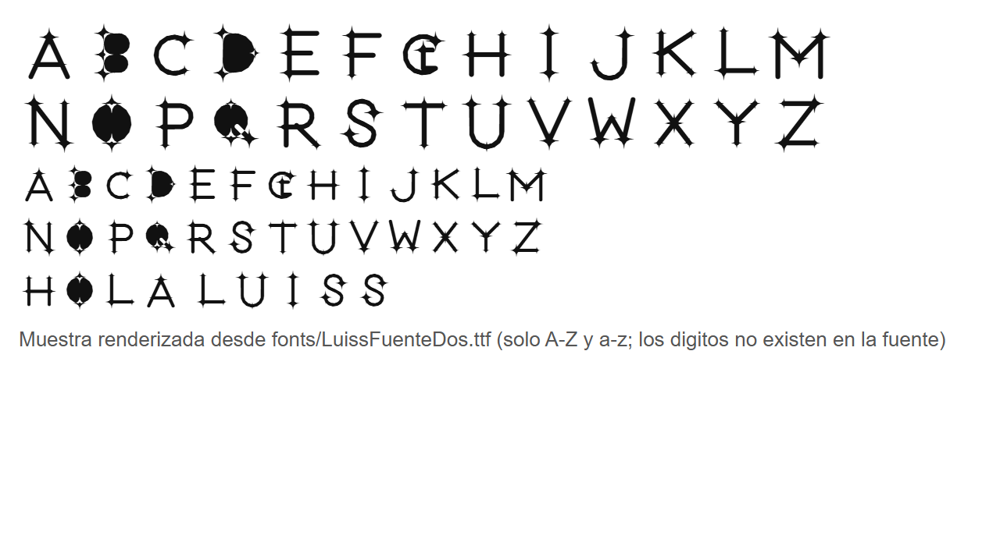
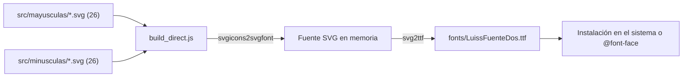

<div align="center">
  
  <h1>SegundaFuente · LuissFuenteDos</h1>
  <p><b>Tipografía decorativa de 26 letras (A-Z) construida a partir de SVGs vectoriales y compilada a TTF con Node.js.</b></p>
  
  
  
  
  <p>
    <a href="#-inicio-rápido">Inicio rápido</a> ·
    <a href="#-características">Características</a> ·
    <a href="#-arquitectura">Arquitectura</a> ·
    <a href="#-pruebas">Pruebas</a> ·
    <a href="#-lo-que-todavía-no-existe">Limitaciones</a>
  </p>
</div>

**LuissFuenteDos** es una fuente decorativa de estilo "blueprint" (trazos finos con destellos en forma de estrella) pensada para títulos, logotipos e iniciales. El repositorio contiene el archivo `.ttf` ya compilado, los SVG de cada glifo y el script que los convierte en fuente. **No** es una familia tipográfica completa: solo cubre letras A-Z y a-z (sin dígitos, signos ni acentos).

## 🎬 Vista rápida



*Captura real generada cargando `fonts/LuissFuenteDos.ttf` con `@font-face`.*

## ✨ Características

| Característica | Detalle |
|---|---|
| Fuente lista para instalar | `fonts/LuissFuenteDos.ttf` (~10 KB) |
| 26 glifos base | Un SVG de 1000x1000 por letra en `src/mayusculas/` (`u0041-A.svg` … `u005A-Z.svg`) |
| Minúsculas | `src/minusculas/` contiene 26 SVG **idénticos byte a byte** a las mayúsculas: `a` se ve como `A` |
| Compilación reproducible | `npm run build` genera el TTF con `svgicons2svgfont` + `svg2ttf` |
| Guías paso a paso | `docs/01-Descargar.md` a `docs/04-Uso.md` (descargar, descomprimir, instalar en Windows/macOS, usar en Word) |

## 🏗️ Arquitectura



`build_direct.js` lee el carácter desde el nombre del archivo (`u0041-A.svg` -> `A`) y lo usa como código Unicode del glifo. `organize.js` es una utilidad auxiliar que copia `glyphr_svgs/gemini_X.svg` a las carpetas `mayusculas/` y `minusculas/`; esa carpeta de origen **no está en el repositorio**.

## 🚀 Inicio rápido

| Requisito | Versión |
|---|---|
| Node.js (solo para recompilar) | Sin versión fijada en el repo |
| Sistema operativo (solo para usar) | Windows, macOS o Linux |

**Solo usar la fuente:** descarga `fonts/LuissFuenteDos.ttf`, haz doble clic y pulsa *Instalar* (ver [docs/03-Instalar.md](docs/03-Instalar.md)).

**Recompilar:**

```bash
npm ci
npm run build   # regenera fonts/LuissFuenteDos.ttf
```

Verificado: `npm ci` + `npm run build` termina bien y produce un TTF de 10 276 bytes, igual al versionado.

<details>
<summary>Uso en CSS</summary>

```css
@font-face {
  font-family: "LuissFuenteDos";
  src: url("fonts/LuissFuenteDos.ttf") format("truetype");
}
h1 { font-family: "LuissFuenteDos", sans-serif; font-size: 72px; }
```

</details>

<details>
<summary>Estructura de carpetas</summary>

```text
build_direct.js        # compila los SVG a TTF
organize.js            # copia glyphr_svgs/ a src/ (requiere una carpeta que no está en el repo)
fonts/LuissFuenteDos.ttf
src/mayusculas/        # 26 SVG (uXXXX-LETRA.svg)
src/minusculas/        # 26 SVG copia de los anteriores
docs/                  # guías de instalación y uso
```

</details>

## 🧪 Pruebas

No hay pruebas automatizadas. La única verificación realizada es manual: compilar y renderizar la fuente en un navegador (captura de arriba).

## 🚧 Lo que todavía no existe

- Solo A-Z / a-z: **sin dígitos, signos de puntuación, espacios diseñados ni letras con tilde/Ñ**; los caracteres ausentes caen a la fuente de reemplazo del sistema.
- Las minúsculas son las mismas formas que las mayúsculas.
- Solo se publica el formato TTF; no hay `.woff`/`.woff2` (una versión anterior de la documentación los mencionaba).
- Los SVG originales/procesados que citaba el README anterior (`src/original_svgs`, `src/processed_svgs`, `build_font.js`) no existen; el script real es `build_direct.js`.
- No hay `LICENSE`, CI ni tests.
- No se incluye la carpeta `glyphr_svgs/` que necesita `organize.js`.

## 📄 Licencia

Sin licencia definida: todos los derechos reservados por defecto.

<div align="center"><sub>Hecho por Luiss2080 · SegundaFuente (LuissFuenteDos)</sub></div>
